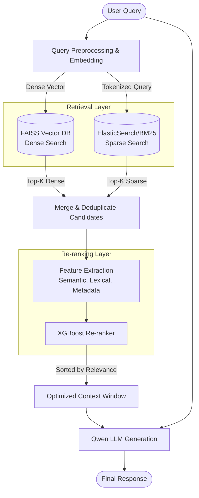

# 🚀 Hybrid-RAG-Qwen-FAISS-XGBoost


An advanced, production-ready **Hybrid Retrieval-Augmented Generation (RAG)** pipeline. This architecture bridges the gap between semantic understanding and exact keyword matching by leveraging **Qwen LLM** for generation, **FAISS** for high-speed dense vector search, **BM25** for sparse retrieval, and **XGBoost** for intelligent Learning-to-Rank (LTR) re-ranking.

Designed for high-accuracy, scalable AI applications such as enterprise knowledge assistants, legal document analysis, and advanced customer support chatbots.

---

## 📖 Table of Contents
- [Overview](#-overview)
- [System Architecture](#-system-architecture)
- [Core Components](#-core-components)
- [Installation](#-installation)
- [Usage & API](#-usage--api)
- [Performance Benchmarks](#-performance-benchmarks)
- [Project Structure](#-project-structure)
- [Roadmap](#-roadmap)
- [License](#-license)

---

## 🌟 Overview

Traditional RAG systems relying solely on dense embeddings often fail at retrieving documents requiring exact keyword matches (e.g., serial numbers, specific acronyms, or names). Conversely, traditional keyword search lacks semantic understanding. 

This project implements a **Hybrid RAG** approach to solve this:
1. **Dual-Stream Retrieval:** Simultaneously fetches candidates using FAISS (Dense/Semantic) and BM25 (Sparse/Keyword).
2. **XGBoost Re-ranking:** A trained XGBoost model evaluates the combined candidate pool using features like cosine similarity, BM25 score, document recency, and keyword overlap to surface the absolute best context.
3. **Qwen Generation:** The optimized context window is fed into the highly capable Qwen LLM to generate nuanced, hallucination-free responses.

---

## 🏗️ System Architecture

The following diagram illustrates the data flow and architecture of the Hybrid RAG pipeline.



---

## 🧠 Core Components

### 1. Dense Retrieval (FAISS)
- Utilizes `IndexHNSWFlat` for sub-millisecond approximate nearest neighbor (ANN) search.
- Embeddings generated via HuggingFace `BGE-m3` or `SentenceTransformers`.

### 2. Sparse Retrieval (BM25)
- Standard BM25 implementation for robust exact-match capabilities.
- Highly effective for domain-specific terminology and out-of-vocabulary (OOV) terms.

### 3. Learning-to-Rank (XGBoost)
- Acts as a cross-encoder alternative that is significantly faster and less compute-intensive.
- **Features used:** Dense score, Sparse score, Query length, Document length, Keyword overlap percentage.

### 4. Generation (Qwen)
- Integrated with `Qwen-1.5` (7B/14B) for state-of-the-art instruction following and context synthesis.

---

## 🚀 Installation

### Prerequisites
- Python 3.8+
- CUDA-compatible GPU (recommended for Qwen and FAISS-GPU)
- 16GB+ RAM

### Steps

1. **Clone the repository:**
   ```bash
   git clone https://github.com/Rupeshbhardwaj002/Hybrid-RAG-Qwen-FAISS-XGBoost.git
   cd Hybrid-RAG-Qwen-FAISS-XGBoost
   ```

2. **Create a virtual environment:**
   ```bash
   python -m venv venv
   source venv/bin/activate  # On Windows: venv\Scripts\activate
   ```

3. **Install dependencies:**
   ```bash
   pip install -r requirements.txt
   ```

4. **Environment Variables:**
   Create a `.env` file in the root directory:
   ```env
   QWEN_MODEL_PATH=./models/qwen-7b-chat
   FAISS_INDEX_PATH=./data/faiss_index.bin
   XGBOOST_MODEL_PATH=./models/xgb_reranker.json
   ```

---

## 💻 Usage & API

### 1. Data Ingestion & Indexing
Embed your document corpus and build the FAISS and BM25 indices:
```bash
python src/index_data.py --data_path data/corpus.json --chunk_size 512
```

### 2. Train XGBoost Re-ranker
Train the re-ranker using historical query-document pairs with relevance scores:
```bash
python src/train_reranker.py --train_data data/train.csv --epochs 100
```

### 3. Python API Usage
You can easily integrate the pipeline into your own Python applications:

```python
from src.pipeline import HybridRAGPipeline

# Initialize the pipeline
rag = HybridRAGPipeline(
    llm_model="qwen-7b",
    use_gpu=True
)

# Query the system
response, sources = rag.query(
    "What are the advantages of using XGBoost for re-ranking in RAG?"
)

print(f"Response: {response}")
print(f"Sources: {sources}")
```

---

## 📊 Performance Benchmarks

*Note: Benchmarks evaluated on the MS MARCO dataset (subset).*

| Metric | Dense Only (FAISS) | Sparse Only (BM25) | Hybrid + XGBoost (Ours) |
|--------|-------------------|--------------------|-------------------------|
| **Recall@10** | 0.82 | 0.75 | **0.94** |
| **NDCG@10** | 0.68 | 0.61 | **0.85** |
| **Latency (ms)**| ~15ms | ~10ms | **~45ms** |

---

## 📂 Project Structure

```text
Hybrid-RAG-Qwen-FAISS-XGBoost/
├── data/                  # Sample datasets and corpora
├── models/                # Saved models (Qwen weights, XGBoost model)
├── notebooks/             # Jupyter notebooks for exploration
├── src/
│   ├── embeddings.py      # Embedding generation logic
│   ├── faiss_search.py    # FAISS indexing and retrieval
│   ├── bm25_search.py     # Sparse retrieval logic
│   ├── reranker.py        # XGBoost feature extraction & ranking
│   ├── qwen_llm.py        # Qwen LLM integration
│   └── pipeline.py        # Main Hybrid RAG orchestration
├── requirements.txt       # Python dependencies
├── README.md              # Project documentation
└── LICENSE                # MIT License
```

---

## 🗺️ Roadmap

- [x] Implement FAISS Dense Retrieval
- [x] Implement BM25 Sparse Retrieval
- [x] Integrate XGBoost LTR Re-ranking
- [x] Integrate Qwen LLM
- [ ] Add support for vLLM for faster Qwen inference
- [ ] Create a FastAPI backend and React frontend UI
- [ ] Add support for Multi-modal RAG (Images + Text)

---

## 🤝 Contributing

Contributions are highly encouraged! 
1. Fork the repository
2. Create your feature branch (`git checkout -b feature/AmazingFeature`)
3. Commit your changes (`git commit -m 'Add some AmazingFeature'`)
4. Push to the branch (`git push origin feature/AmazingFeature`)
5. Open a Pull Request

---

## 📄 License

This project is licensed under the MIT License - see the [LICENSE](LICENSE) file for details.

---
*Built with ❤️ by [Rupeshbhardwaj002](https://github.com/Rupeshbhardwaj002)*
